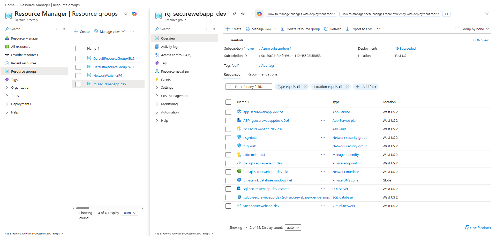
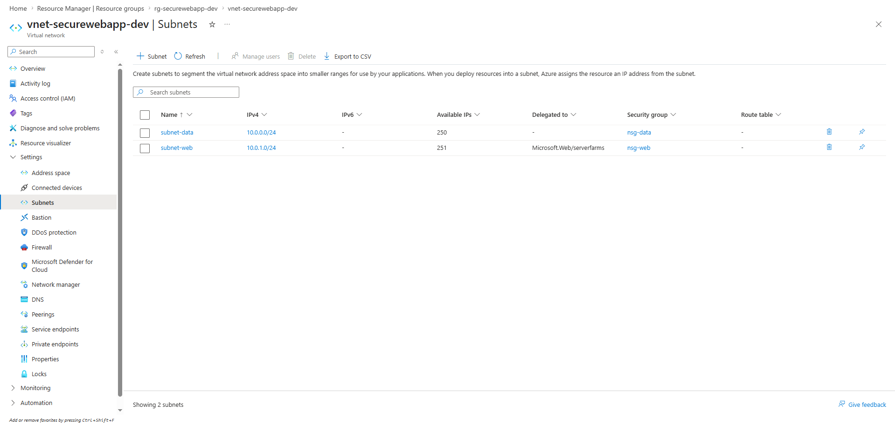
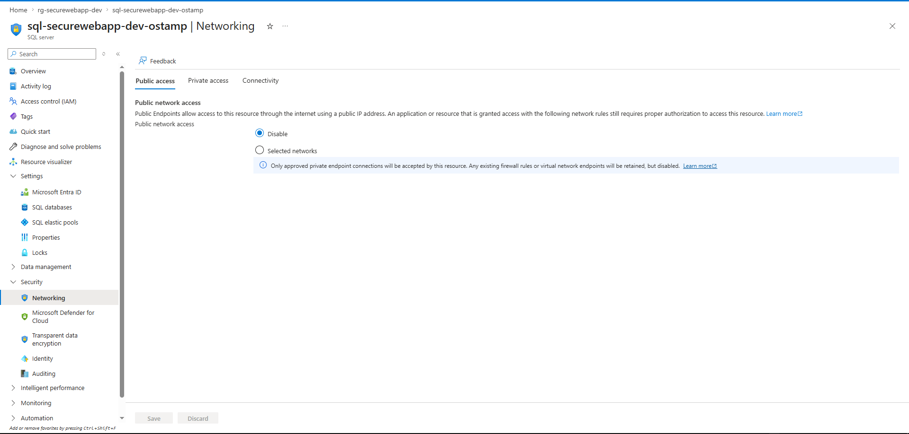
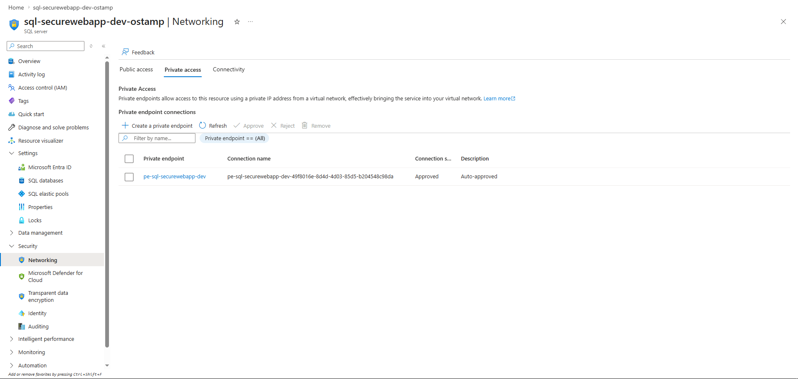
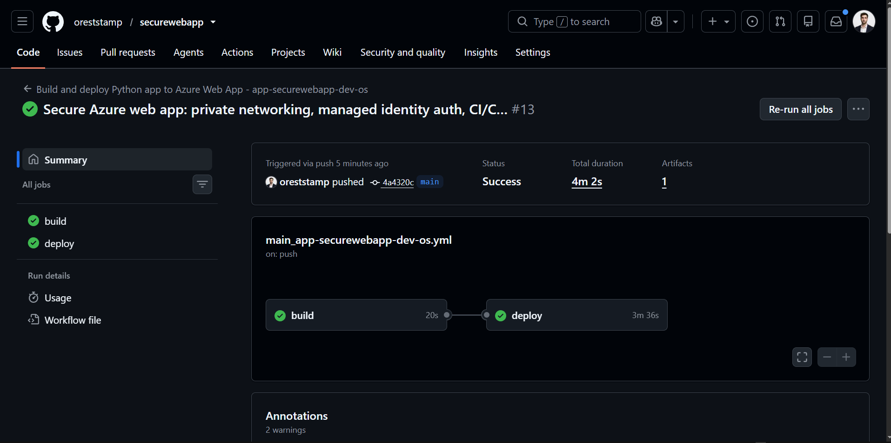
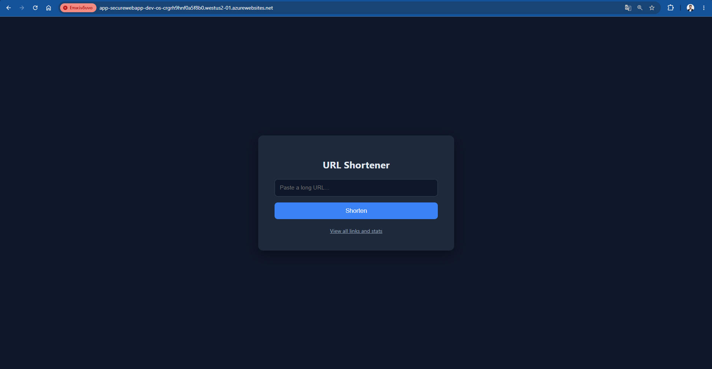
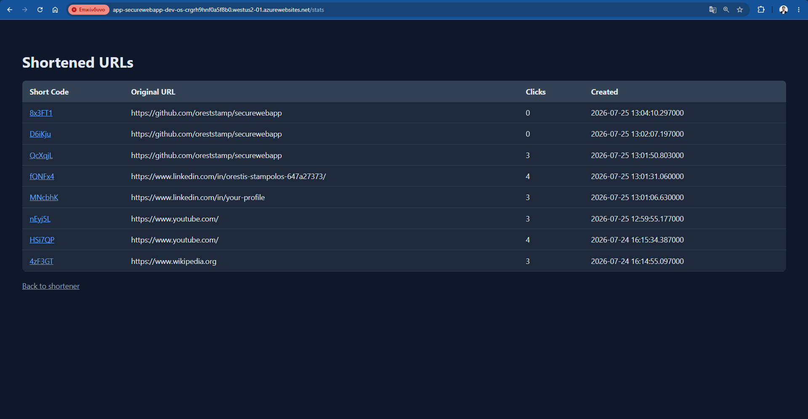
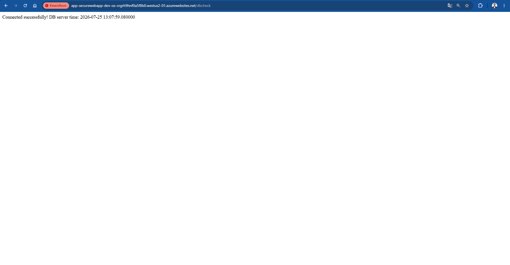
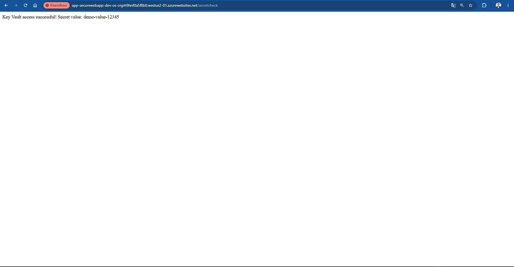

# Secure URL Shortener on Azure

A URL shortener application deployed on Azure, built around a security-first infrastructure design rather than around the app itself. The application is intentionally simple — the goal of this project is to demonstrate a private, production-style architecture: network isolation, password-free authentication, and automated CI/CD deployment.

**Live app:** `https://app-securewebapp-dev-os-crgrh9hnf0a5f8b0.westus2-01.azurewebsites.net/`

> Note: the generated "short" links use Azure's default App Service hostname, so they are not visually short. In a production setup this would sit behind a custom short domain (e.g. `sho.rt`). The link generation, redirect, and click-tracking logic all work correctly — only the domain length is a cosmetic limitation of using Azure's free default hostname.

---

## What this project demonstrates

- A database that is **never reachable from the public internet**, under any circumstance
- **Zero stored passwords** — authentication to both the database and the secrets store uses Azure Managed Identity
- Network segmentation using subnets and NSGs, following a standard 3-tier pattern
- A working CI/CD pipeline that builds and deploys automatically on every push
- A real, working feature (not just a health-check page) — a URL shortener with click tracking, backed by the secured database

---

## Architecture

```
Internet
   │
   ▼
App Service (public HTTPS endpoint)
   │  Managed Identity (no password)
   │  VNet Integration → subnet-web
   ▼
Private DNS Zone resolves SQL hostname → private IP
   │
   ▼
Private Endpoint → subnet-data
   │
   ▼
Azure SQL Database (public access disabled)

App Service also authenticates to:
   │
   ▼
Azure Key Vault (RBAC, Managed Identity, no password)
```

**Network layout:**
- `vnet-securewebapp-dev` (10.0.0.0/16)
  - `subnet-web` (10.0.1.0/24) — hosts the App Service VNet integration point, outbound internet access enabled
  - `subnet-data` (10.0.0.0/24) — hosts the SQL private endpoint, no outbound internet access, inbound restricted to VNet traffic only via NSG

**NSG rules:** `nsg-data` allows inbound SQL traffic (port 1433) only from the `VirtualNetwork` service tag — no other inbound traffic is permitted, and there is no path from the public internet to the database under any configuration.

---

## Why each component was chosen

| Component | Purpose |
|---|---|
| **Virtual Network + Subnets** | Isolates resources into private network zones; separates the public-facing tier from the data tier |
| **Network Security Groups** | Enforces which traffic is allowed between subnets, independent of any other setting |
| **Azure SQL Database (Private Endpoint)** | Gives the database a private IP inside the VNet and disables all public network access |
| **Private DNS Zone** | Ensures the SQL hostname resolves to its private IP for anything inside the linked VNet, rather than falling back to the public IP |
| **App Service** | Hosts the application; the one component intentionally exposed to the internet |
| **Managed Identity** | Replaces stored passwords entirely for both SQL authentication and Key Vault access |
| **Azure Key Vault (RBAC)** | Centralized, access-controlled secret storage, demonstrated with a sample secret retrieved by the app at runtime |
| **GitHub Actions** | Automated build and deploy pipeline, triggered on every push to `main` |

---

## The application

A URL shortener with three real routes:

- `/` — submit a long URL via a form, receive a generated short code
- `/<code>` — redirects to the original URL and increments a click counter
- `/stats` — lists all shortened URLs with their click counts and creation dates

Two additional routes exist specifically to demonstrate the security architecture in action:

- `/dbcheck` — opens an authenticated connection to SQL via Managed Identity and returns the database server's current time
- `/secretcheck` — retrieves a sample secret from Key Vault via Managed Identity and returns its value

---

## Screenshots

**Architecture proof**

*Resource group overview — full resource inventory*


*VNet subnets — subnet-web and subnet-data with assigned NSGs*


*SQL Networking — public access disabled*


*SQL Networking — private endpoint connection, approved*


**CI/CD**

*GitHub Actions — successful build and deploy on the cleaned commit history*


**The working app**

*URL shortener form*


*Stats page — real shortened links with click counts*


*dbcheck — successful Managed Identity authentication to SQL*


*secretcheck — successful Managed Identity authentication to Key Vault*


---

## Tech stack

- **Compute:** Azure App Service (Linux, Python 3.12)
- **Database:** Azure SQL Database (Serverless tier)
- **Secrets:** Azure Key Vault (RBAC permission model)
- **Networking:** Azure Virtual Network, Network Security Groups, Private Endpoint, Private DNS Zone
- **Identity:** System-assigned Managed Identity
- **CI/CD:** GitHub Actions
- **Application:** Python, Flask, pyodbc, azure-identity, azure-keyvault-secrets

---

## Debugging story: what actually went wrong (and why it's worth reading)

Getting this architecture working end-to-end was not a straight line, and the failures were genuinely instructive rather than trivial typos:

1. **Empty `requirements.txt`** committed by mistake caused the deployed app to crash with `ModuleNotFoundError: No module named 'pyodbc'` — even though the dependency was declared.
2. **Misdiagnosis under pressure:** assuming `pyodbc` was failing to compile on Azure's build system, the fix applied was to disable Azure's build process (Oryx) entirely and ship a pre-built virtual environment from the GitHub Actions runner instead.
3. **This introduced a second, harder problem:** the pre-built environment was compiled against a newer version of `glibc` than Azure's App Service Linux image provides, causing `antenv/bin/python: version 'GLIBC_2.34' not found` — a binary compatibility failure between two different Linux environments.
4. **The actual fix** was to revert both mistakes: fix the empty `requirements.txt`, and let Azure's own build system (Oryx) install dependencies directly on its own compatible image, rather than shipping a foreign-built environment.
5. **A final, separate issue** surfaced once the app was running: SQL connections failed with `Connection was denied because Deny Public Network Access is set to Yes`, even though the private endpoint was correctly configured. The cause was a missing **Virtual Network Link** on the Private DNS Zone — without it, DNS queries from inside the VNet fell back to the public IP instead of resolving to the private endpoint's private IP.

Each of these was diagnosed using Azure's Log Stream and GitHub Actions logs, one layer at a time, rather than guessing.

---

## Known limitations

- Generated "short" links use Azure's default hostname and are not visually short (see note above)
- Monitoring and alerting (Log Analytics + alert rules) were attempted but blocked by a persistent Azure Portal authentication error (`InvalidAuthenticationToken`) when loading Diagnostic Settings, which did not resolve after registering the `Microsoft.Insights` resource provider, clearing sessions, or using a fresh browser profile. This is a good candidate for a future iteration.
- Key Vault uses public network access (not a private endpoint) since it stores only a demonstration secret in this project. In a production system handling real credentials, it would follow the same private endpoint pattern used for SQL.

---

## Cost notes

This project runs on Azure's free-tier allowances where possible (SQL Serverless with auto-pause, Key Vault's free operation tier). The App Service Plan requires at least the **Basic (B1)** tier rather than Free (F1), since the F1 tier does not support Regional VNet Integration, which this architecture depends on for private database connectivity.
